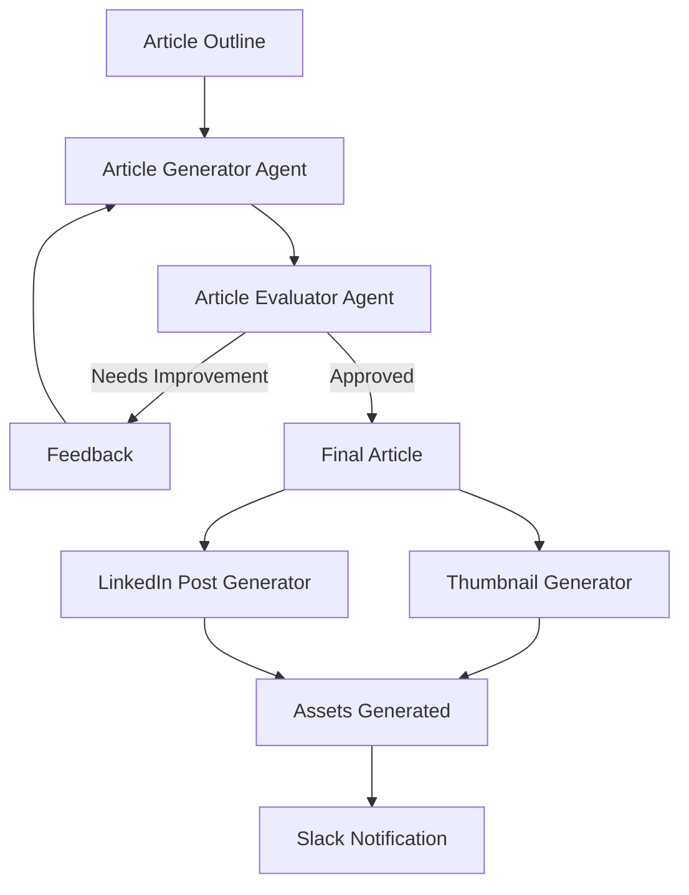

# 🚀 AI Workflow

> End-to-end AI-powered content generation pipeline built with Python and OpenAI.

[]()
[]()
[]()
[]()

## 📖 Overview

AI Workflow is an automated content generation pipeline that transforms a simple article outline into a complete content package.

The system leverages multiple AI-powered stages to:

* Generate blog articles
* Evaluate content quality
* Improve drafts iteratively
* Create thumbnails automatically
* Generate LinkedIn posts
* Notify teams via Slack

This project demonstrates how multiple AI agents can collaborate within a structured workflow to automate content creation while maintaining quality standards.

---

## ✨ Features

### 📝 Article Generation

Generate complete blog posts from a simple outline using GPT models.

### 🤖 AI Quality Review

An evaluation agent reviews the generated article and determines whether improvements are needed.

### 🔄 Iterative Refinement

The workflow automatically refines content based on AI-generated feedback or user feedback.

### 🎨 Thumbnail Generation

Creates a custom thumbnail using OpenAI image generation.

### 💼 LinkedIn Post Generation

Automatically produces a LinkedIn-ready post based on the final article.

### ⚡ Parallel Processing

Thumbnail generation and LinkedIn content creation run simultaneously using Python's ThreadPoolExecutor.

### 🔔 Slack Integration

Sends notifications when content generation is completed.

---

## 🏗️ Workflow Architecture



---

## 🧠 AI Components

### Content Generation Agent

Responsible for generating blog articles from outlines while following writing style examples.

### Evaluation Agent

Reviews article quality based on:

* Clarity
* Structure
* Readability
* Engagement
* Technical accuracy

### Image Generation Agent

Creates article thumbnails using OpenAI image models.

### Social Media Agent

Generates LinkedIn posts based on the final article.

---

## 🛠️ Tech Stack

| Category              | Technology         |
| --------------------- | ------------------ |
| Language              | Python             |
| AI Models             | GPT-4o             |
| Image Generation      | GPT Image          |
| Validation            | Pydantic           |
| Environment Variables | Python Dotenv      |
| HTTP Requests         | Requests           |
| Notifications         | Slack API          |
| Concurrency           | ThreadPoolExecutor |

---

## 📂 Project Structure

```text
.
├── example_posts/
│   └── Blog post examples
│
├── example_linkedin_posts/
│   └── LinkedIn examples
│
├── main.py
│
├── .env
│
└── README.md
```

---

## ⚙️ Installation

Clone the repository:

```bash
git clone https://github.com/gi44n/AI_workflow.git
cd AI_workflow
```

Install dependencies:

```bash
uv sync
```

or

```bash
pip install -r requirements.txt
```

---

## 🔑 Environment Variables

Create a `.env` file:

```env
OPENAI_API_KEY=your_openai_api_key
SLACK_ACCESS_TOKEN=your_slack_token
```

---

## ▶️ Usage

Create an outline file:

```text
outline.txt
```

Example:

```text
Topic: AI Agents

Sections:
- What are AI Agents
- Benefits
- Challenges
- Future Applications
```

Run:

```bash
python main.py outline.txt
```

---

## 📤 Output

The workflow generates:

```text
outline_draft.md
outline_thumbnail.jpeg
outline_linkedin_post.txt
```

---

## 🚧 Future Improvements

* WordPress integration
* Notion integration
* Multi-language content generation
* SEO optimization agent
* Automatic publishing
* Retrieval-Augmented Generation (RAG)
* Agent orchestration frameworks (LangGraph / CrewAI)

---

## 👨‍💻 Author

### Caio Gonçalves

Full Stack Developer focused on:

* Artificial Intelligence
* AI Agents
* Process Automation
* Backend Development
* Data Analytics

📫 Connect with me on LinkedIn and GitHub.

---

⭐ If you found this project interesting, consider giving it a star.
